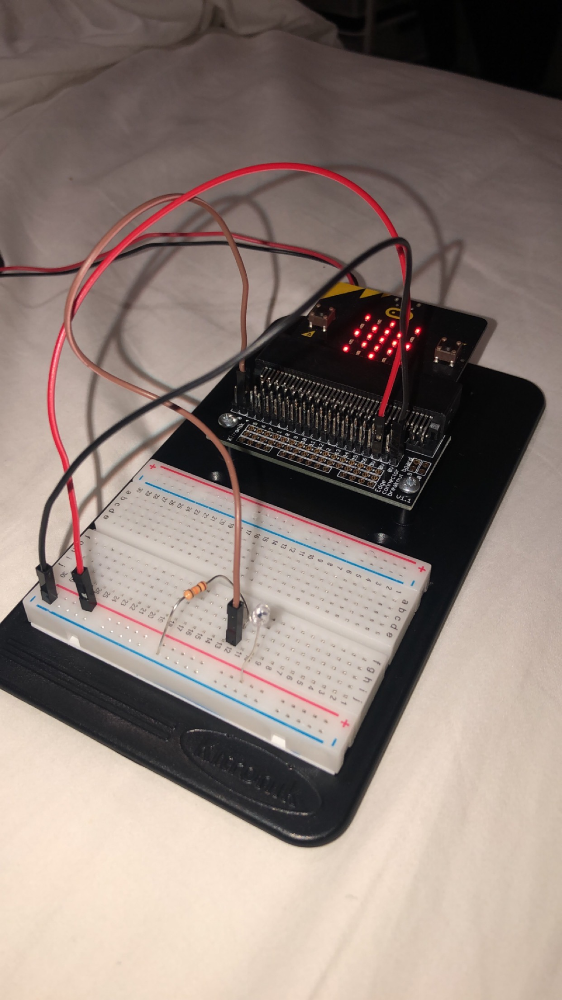
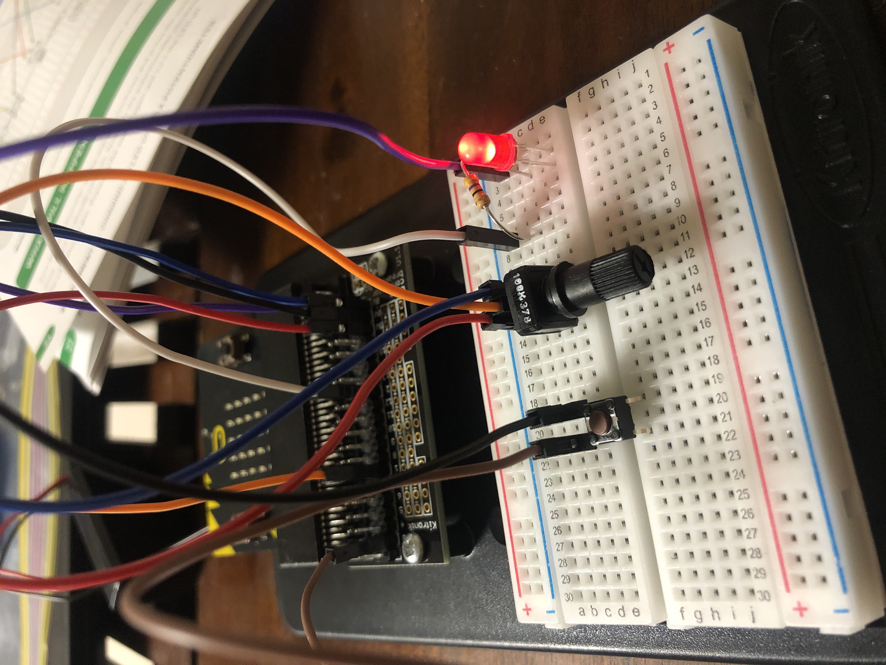
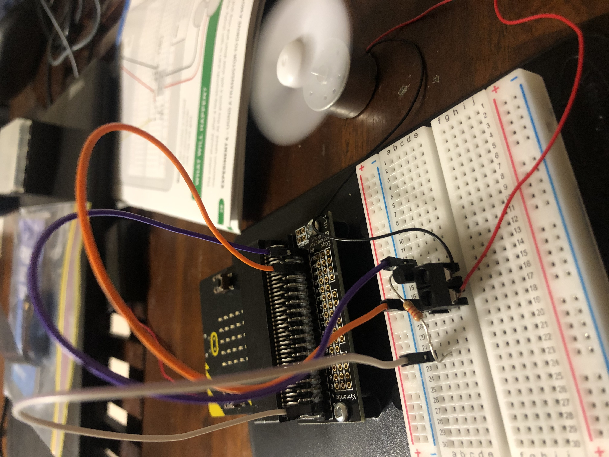
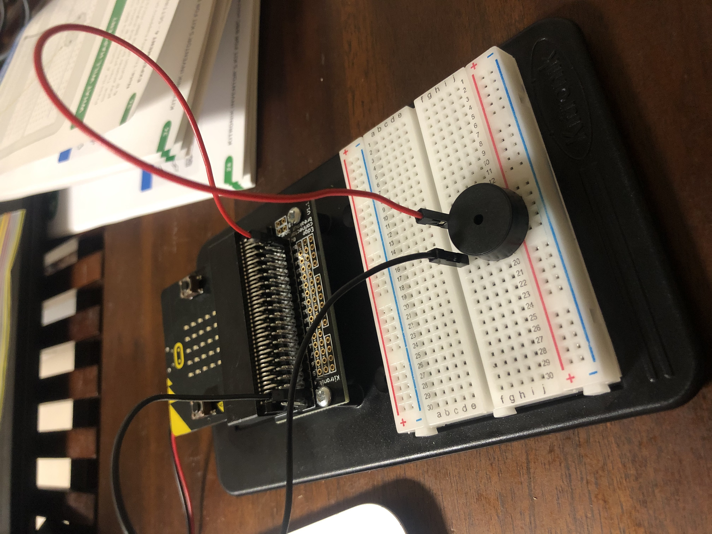

# Inventor Kit Experiments

*Markdown reference: https://guides.github.com/features/mastering-markdown/*

## Instructions ##

*For a selection of 5 inventor kit experiments that you choose, fill out the following sections.

### Experiment name ###

(Experiment 1)

#### Photo of completed project ####
*In the code below, replace `missingimage.png` with the name of the image, which should be in the `kitexperiments` folder.*

Connection buttons

#### Reflection ####

In this experiment, something new to me was or something I learned was the basics when it come to connecting wires from differnt pins to create a circit.

This experiment could be the basis of a real world application such as some sort of simple interaction toy for pets to get different rewards and things.

### Experiment name ###

(Experiment 2)

#### Photo of completed project ####
In the code below, replace imagemissing.jpg with the name of the image, which should be in the kitexperiments folder.

Sunlight detector

#### Reflection ####

In this experiment, something new to me was or something I learned was how changing the code can make the phototransister more or less sensitive to light.

This experiment could be the basis of a real world application such as automatic lights. as the daylight gets darker it could adjust artificial lights to brighten a room.

### Experiment name ###

Experiment 3

#### Photo of completed project ####
In the code below, replace imagemissing.jpg with the name of the image, which should be in the kitexperiments folder.

Adjustable light

#### Reflection ####

In this experiment, something new to me was or something I learned was using a dial to adjust the brightness of the light.

This experiment could be the basis of a real world application such as household lights.

### Experiment name ###

Experiment 4

#### Photo of completed project ####
In the code below, replace imagemissing.jpg with the name of the image, which should be in the kitexperiments folder.

Looping a fan

#### Reflection ####

In this experiment, something new to me was or something I learned was how to create forever loops.

This experiment could be the basis of a real world application such as things likes airconditioning or pool filters, telling them to turn on and puase off for a certtain amount of time.

### Experiment name ###

Experiment 6

#### Photo of completed project ####
In the code below, replace imagemissing.jpg with the name of the image, which should be in the kitexperiments folder.

creating noise

#### Reflection ####

In this experiment, something new to me was or something I learned was how to microbit speaker works.

This experiment could be the basis of a real world application such as childrens toys that make sound.

