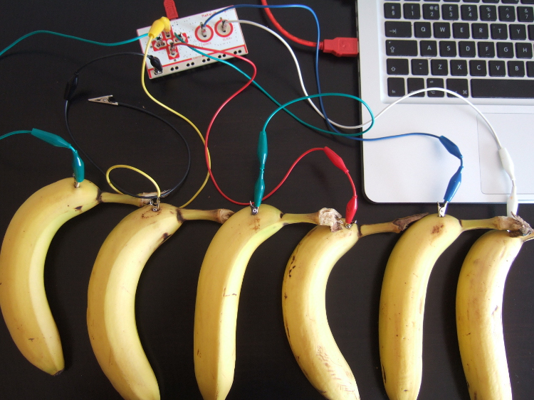
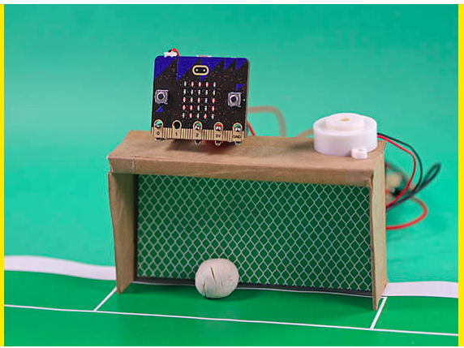
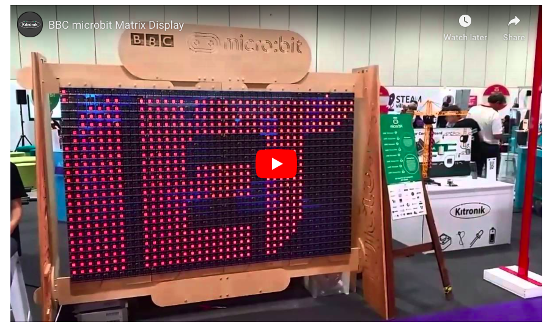
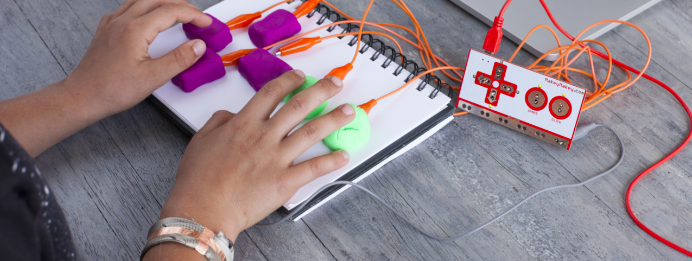
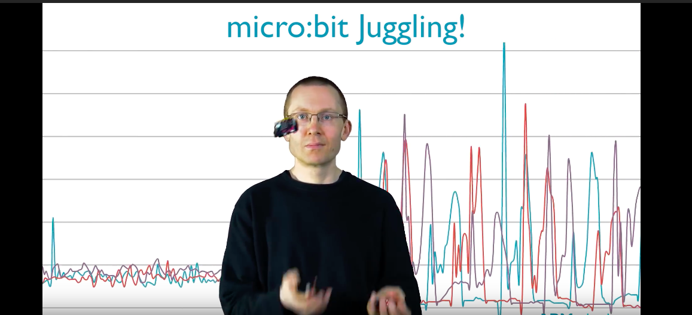

# Assessment 1: Replication project

*Fill out the following workbook with information relevant to your project.*

*Markdown reference:* [https://guides.github.com/features/mastering-markdown/](http://guides.github.com/features/mastering-markdown/)

## Replication project choice ##
(Insert the name of the project you chose to replicate.)

## Related projects ##
*Find about 6 related projects to the project you choose. A project might be related through  function, technology, materials, fabrication, concept, or code. Don't forget to place an image of the related project in the* `replicationproject` *folder and insert the filename in the appropriate places below. Copy the markdown block of code below for each project you are showing, updating the number* `1` *in the subtitle for each.*

### Related project 1 ###
Banana Keybaord 

https://librarymakers.net/piano-keyboard-makey-makey

This project is related to mine because its a very similar preject except using many bananas instead of one and its also made with a MayKey MaKey. im going to try ad use this to help add to my banana keyboard rather then using a single banana.

### Related project 2 ###
microbit electro football

https://make.techwillsaveus.com/microbit/activities/microfootball

This project is related to mine because this project also uses a micro bit and forces the user to get involved, the outcome of the project on each use is dependant on the user rather then a forever loop that repeats actions on start.

### Related project 3 ###
1000 BBC Micro:bit display

https://www.kitronik.co.uk/blog/building-the-bbc-microbit-matrix-display/

This project is related to mine because it also uses the microbit, though on a much larger scale. it uses one mastermind microbit to communicate to all others allowing the user to display messages on a board made up of 1000 microbits..

### Related project 4 ###
playdough controller

https://makeymakey.com/blogs/how-to-instructions/create-a-controller-to-plug-and-play-1

This project is related to mine because it forces the user to interact with the play dough buttons, like the banana keyboard but instead its a controller.

### Related project 5 ###
Juggling with the BBC micro:bit

https://www.youtube.com/watch?v=OLzhXRwUhrw

This project is related to mine because it too is an interactive project using the microbit. using the accelerometre in the microbit they are able to send data to a graph where we can see the movement of the microbit.

## Reading reflections ##
*Reflective reading is an important part of actually making your reading worthwhile. Don't just read the words to understand what they say: read to see how the ideas in the text fit with and potentially change your existing knowledge and maybe even conceptual frameworks. We assume you can basically figure out what the readings mean, but the more important process is to understand how that changes what you think, particularly in the context of your project.*

*For each of the assigned readings, answer the questions below.*

### Reading: Don Norman, The Design of Everyday Things, Chapter 1 (The Psychopathology of Everyday Things) ###

*What I learned: Describe what you now know or believe as a result of the reading. Don't just describe the reading: write about what changed in YOUR knowledge.*

i learned that feedback communication is essential to be imideate because if its not people can give up and move on.

*What I would like to know more about: Describe or write a question about something that you would be interested in knowing more about.*

how someone with a different kind of life or a disability interact and think about things that are presented to them.

*How this relates to the project I am working on: Describe the connection between the ideas in the reading and one of your current projects or how ideas in the reading could be used to improve your project.*

the banana keyboard forces the user to think a little and physicaly interact with it to understand how it works with no insruction.

### Reading: Chapter 1 of Dan Saffer, Microinteractions: Designing with Details, Chapter 1 ###

*What I thought before: Describe something that you thought or believed before you read the source that was challenged by the reading.*

before i overlooked many devices, but after reading and thinking about them they are very lifesaving.

*What I learned: Describe what you now know or believe as a result of the reading. Don't just describe the reading: write about what changed in YOUR knowledge.*

i learned that there are four parts to a micro interaction, the trigger, the rules, feedback and the loops

*What I would like to know more about: Describe or write a question about something that you would be interested in knowing more about.*

what goes on behind the scenes when designing one of these

*How this relates to the project I am working on: Describe the connection between the ideas in the reading and one of your current projects or how ideas in the reading could be used to improve your project.*

my project is designed to have one function, to press a button and make a sound

### Reading: Scott Sullivan, Prototyping Interactive Objects ###

*What I thought before: Describe something that you thought or believed before you read the source that was challenged by the reading.*

*What I learned: Describe what you now know or believe as a result of the reading. Don't just describe the reading: write about what changed in YOUR knowledge.*

*What I would like to know more about: Describe or write a question about something that you would be interested in knowing more about.*

*How this relates to the project I am working on: Describe the connection between the ideas in the reading and one of your current projects or how ideas in the reading could be used to improve your project.*

## Interaction flowchart ##
*Draw a flowchart of the interaction process in your project. Make sure you think about all the stages of interaction step-by-step. Also make sure that you consider actions a user might take that aren't what you intend in an ideal use case. Insert an image of it below. It might just be a photo of a hand-drawn sketch, not a carefully drawn digital diagram. It just needs to be legible.*

## Process documentation

*In this section, include text and images that represent the development of your project including sources you've found (URLs and written references), choices you've made, sketches you've done, iterations completed, materials you've investigated, and code samples. Use the markdown reference for help in formatting the material.*

*This should have quite a lot of information!*

*There will likely by a dozen or so images of the project under construction. The images should help explain why you've made the choices you've made as well as what you have done. Use the code below to include images, and copy it for each image, updating the information for each.*

*Include screenshots of the code you have used.*

## Project outcome ##

*Complete the following information.*

### Project title ###

### Project description ###

*In a few sentences, describe what the project is and does, who it is for, and a typical use case.*

### Showcase image ###

*Try to capture the image as if it were in a portfolio, sales material, or project proposal. The project isn't likely to be something that finished, but practice making images that capture the project in that style.*

### Additional view ###

*Provide some other image that gives a viewer a different perspective on the project such as more about how it functions, the project in use, or something else.*

### Reflection ###

*Describe the parts of your project you felt were most successful and the parts that could have done with improvement, whether in terms of outcome, process, or understanding.*

*What techniques, approaches, skills, or information did you find useful from other sources (such as the related projects you identified earlier)?*

*What ideas have you read, heard, or seen that informed your thinking on this project? (Provide references.)*

*What might be an interesting extension of this project? In what other contexts might this project be used?*
